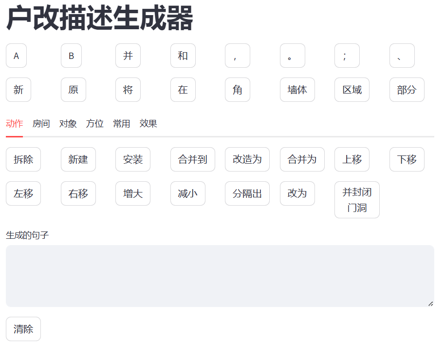

# 户改描述生成器

# 项目介绍
## 做这个项目的原因
因为最近在做AI数据标注的实习，目前在做的项目需要根据户型图输入大量户改描述，然后我遇到了以下的问题：
1. 一整天打字太累，希望有更省力的方式生成描述。
2. 户改描述的格式和语言基本固定，重复工作较多，让人感到枯燥。
- 简单的说，就是希望在撰写描述更省力的同时让工作更有趣。
- 以《黑暗之魂》的谏言系统为灵感，使用ChatGPT、Kimi和Qwen合作开发，最终得到这个项目。
## 这个项目具有以下优点：
- 通过点击卡片建立句子的方式构建户改描述，减少打字量，从而增加标注效率；
- 比纯打字省力，而且不会出现错别字；
- 使标注的语言标准化和一致化，便于质检和标注。

# 快速开始
1. 安装streamlit库，在命令行`pip install streamlit`
2. 在命令行输入`streamlit run hugai.py`，即可运行服务器并打开网页应用

## 功能介绍
- 点击卡片即可在文本框中构建描述。
- 也支持修改文本框文字，需要点一下文本框外面进行保存。如果用Ctrl+Enter，需要光标在最后面才有效，建议鼠标点外面保存。
- hugai.py中有一个Python字典形式的词汇表，支持自定义卡片的文字。

# 使用建议
- 可能并不一定比打字快，但应该更省力。
- 并不一定每个字都要按出来，觉得麻烦可以在文本框直接打字，但是记得保存和复制。
- 主要用于懒得打字和描述很多很繁琐时。
# 改进计划
- 征集改进意见
  - 目前的主要问题还是切换选修卡麻烦一些，也许可以增加快捷键？（x)
  - 需要更加专门化、模板化来提高效率
  - 点完一类后，自动跳转到对应选项卡，节省时间；创建一些短链（language chain)进行联想推荐
